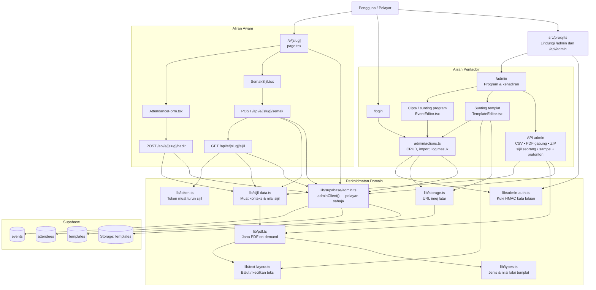

# Code Graph — Sistem e-Sijil & Kehadiran

## Ringkasan sempadan tanggungjawab

- **Awam**: peserta merekod kehadiran dan memuat turun sijil melalui pautan program.
- **Pentadbir**: semua laluan `/admin` dan `/api/admin` disaring oleh `proxy.ts`; tindakan
  mutasi dikumpulkan dalam `src/app/admin/actions.ts`.
- **Domain**: `sijil-data.ts` menukar data program/peserta kepada nilai sijil, manakala
  `pdf.ts` menjana PDF pada masa permintaan tanpa menyimpan fail PDF.
- **Data**: hanya `adminClient()` berhubung dengan Supabase. Jadual utama ialah `events`,
  `attendees`, dan `templates`; imej latar templat berada dalam baldi `templates`.
