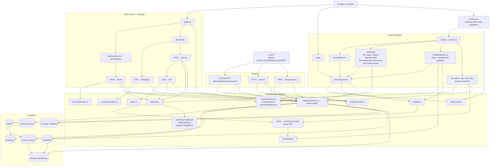

# Code Graph — Sistem e-Sijil & Kehadiran

Peta seni bina ringkas. Baca ini dahulu sebelum mengimbas seluruh repo.
Keputusan reka bentuk (mengapa) kekal di `AI_CONTEXT_LOG.md`.

```mermaid
flowchart TB
  Browser["Pengguna / Pelayar"]
  Eustp["eUSTP\nBearer EUSTP_INTEGRATION_SECRET"]
  Proxy["src/proxy.ts\nLindungi /admin dan /api/admin"]

  subgraph Public["Aliran Awam — /e/[slug]"]
    PublicPage["page.tsx"]
    Attendance["AttendanceForm + SchoolPicker"]
    Check["SemakSijil"]
    AttendAPI["POST .../hadir"]
    SuggestAPI["GET .../cadangan"]
    CheckAPI["POST .../semak"]
    DownloadAPI["GET .../sijil"]
  end

  subgraph Admin["Aliran Pentadbir"]
    Login["/login"]
    Dashboard["/admin — EventList"]
    EventEditor["EventEditor.tsx"]
    EventDetail["events/[id]\nQR, status, import, AttendeeTable\nSchoolAttendanceSummary jika medan school"]
    TemplateEditor["TemplateEditor.tsx\ninduk + templat khas program"]
    Actions["admin/actions.ts"]
    AdminExports["API admin: CSV, PDF, ZIP, sampel, pratonton"]
  end

  subgraph Integration["Integrasi"]
    EustpAPI["POST/PATCH /api/integrations/eustp/events"]
    EustpCancel["POST .../cancel"]
    EustpMerge["POST .../merge-legacy"]
  end

  subgraph Domain["Perkhidmatan Domain"]
    Auth["admin-auth.ts"]
    IntAuth["integration-auth.ts"]
    Submit["form-submission.ts"]
    Schools["school-directory.ts\nschool-picker.ts\nschool-attendance.ts"]
    SijilData["sijil-data.ts"]
    CertSearch["certificate-search.ts"]
    CertMap["certificate-mapping.ts\ncertificate-title.ts\nprogram-template.ts"]
    Token["token.ts"]
    PDF["pdf.ts — on-demand, tiada storan PDF"]
    Layout["text-layout.ts"]
    Storage["storage.ts"]
    DB["supabase/admin.ts — adminClient()"]
  end

  subgraph External["Supabase"]
    Events[("events")]
    Attendees[("attendees")]
    Templates[("templates")]
    SchoolDir[("school_directory")]
    Sessions[("event_sessions")]
    SessionAtt[("session_attendances")]
    Bucket[("Storage: templates")]
  end

  Browser --> PublicPage
  PublicPage --> Attendance --> AttendAPI
  PublicPage --> Check
  Check --> SuggestAPI
  Check --> CheckAPI --> DownloadAPI
  DownloadAPI --> Token
  AttendAPI --> Submit
  AttendAPI --> Schools
  SuggestAPI --> CertSearch

  Browser --> Login --> Actions
  Browser --> Proxy --> Dashboard
  Proxy --> Auth
  Dashboard --> EventEditor --> Actions
  Dashboard --> EventDetail --> Actions
  EventDetail --> Schools
  Dashboard --> TemplateEditor --> Actions
  Dashboard --> AdminExports
  Actions --> Auth

  Eustp --> EustpAPI
  Eustp --> EustpCancel
  Eustp --> EustpMerge
  EustpAPI --> IntAuth
  EustpCancel --> IntAuth
  EustpMerge --> IntAuth

  AttendAPI --> SijilData
  CheckAPI --> SijilData
  DownloadAPI --> SijilData --> PDF
  AdminExports --> SijilData
  AdminExports --> PDF
  SijilData --> CertMap
  TemplateEditor --> Layout
  TemplateEditor --> Storage
  PDF --> Layout
  Actions --> Storage

  PublicPage --> DB
  AttendAPI --> DB
  SuggestAPI --> DB
  CheckAPI --> DB
  DownloadAPI --> DB
  Actions --> DB
  AdminExports --> DB
  EustpAPI --> DB
  EustpCancel --> DB
  EustpMerge --> DB
  DB --> Events
  DB --> Attendees
  DB --> Templates
  DB --> SchoolDir
  DB --> Sessions
  DB --> SessionAtt
  Storage --> Bucket
  Events --> Sessions
  Sessions --> SessionAtt
  Attendees --> SessionAtt
  Events -.-> Templates
```

## Fail mengikut tugas

| Tugas | Fail utama |
| --- | --- |
| Borang kehadiran awam | `src/app/e/[slug]/AttendanceForm.tsx`, `SchoolPicker.tsx`, `src/lib/form-submission.ts` |
| Direktori sekolah | `src/lib/school-directory.ts`, `src/lib/school-picker.ts`, `scripts/import-school-directory.mjs` |
| Semak kehadiran sekolah (admin) | `src/lib/school-attendance.ts`, `src/app/admin/events/[id]/SchoolAttendanceSummary.tsx` (kumpulan mengikut PKG / zon) |
| Carian / muat turun sijil | `SemakSijil.tsx`, `src/lib/certificate-search.ts`, `src/app/api/e/[slug]/cadangan\|semak\|sijil` |
| Jana PDF | `src/lib/pdf.ts`, `src/lib/sijil-data.ts`, `src/lib/text-layout.ts` |
| Templat khas program | `src/lib/program-template.ts`, `src/lib/certificate-title.ts`, `TemplateEditor.tsx` |
| CRUD admin | `src/app/admin/actions.ts` |
| eUSTP | `src/lib/integration-auth.ts`, `src/app/api/integrations/eustp/events/` |
| Skema DB | `supabase/migration.sql` (idempotent) |

## Sempadan tanggungjawab

- **Awam**: peserta merekod kehadiran (termasuk sesi eUSTP / kehadiran lewat) dan muat turun sijil melalui pautan program. Cadangan nama (`cadangan`) hanya aktif bila status `released`.
- **Pentadbir**: `/admin` dan `/api/admin` dilindungi `proxy.ts`. Mutasi dalam `admin/actions.ts`. Medan borang `type === "school"` memaparkan ringkasan kehadiran sekolah pada halaman program, dikumpulkan mengikut PKG (zon).
- **eUSTP**: API peribadi (bukan kuki admin). Event idempotent pada `(external_source, external_booking_id)`. Sesi harian dalam `event_sessions`; kehadiran sesi dalam `session_attendances`.
- **Templat**: senarai Urus Templat = induk (`owner_event_id IS NULL`). Salinan khas program: `owner_event_id` + `source_template_id`. PDF on-demand; jangan simpan fail PDF.
- **Data**: hanya `adminClient()` (service role, pelayan sahaja) menyentuh Supabase. Jenis medan `school` simpan kod; label `KOD — NAMA` diselesaikan dari `school_directory`.

Kemas kini fail ini apabila menambah laluan, jadual, atau aliran utama.
